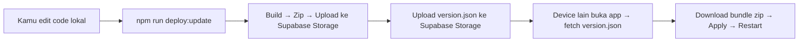

# 🚀 Self-Hosted Update System — Setup Guide

## Masalah Sebelumnya

Update tidak terdeteksi karena sistem lama (`@capgo/capacitor-updater` dengan `autoUpdate: true`) mengandalkan **Capgo cloud** — yang mengharuskan kamu upload bundle ke server mereka via CLI (`npx @capgo/cli bundle upload`). Karena kamu tidak pernah upload ke Capgo cloud, `getLatest()` selalu bilang "sudah terbaru".

## Solusi: Self-Hosted via Supabase

Sekarang update system sepenuhnya **self-hosted** menggunakan Supabase:



## 📋 Setup (Satu Kali)

### Step 1: Jalankan SQL di Supabase

Buka **Supabase Dashboard → SQL Editor** dan jalankan isi file:

[setup-update-system.sql](file:///c:/Users/ramad/data_coding/game/scripts/setup-update-system.sql)

Ini akan:
- Membuat tabel `app_updates` 
- Membuat storage bucket `app-bundles` (private)
- Setup RLS policies (read publik, write hanya service_role)

### Step 2: Build & Deploy APK Pertama Kali

```bash
# Build dan sync ke Android
npm run cap:sync

# Build APK dan install di semua device target
npm run cap:run
```

### Step 3: Deploy Update Pertama

```bash
npm run deploy:update
```

> [!IMPORTANT]
> Setelah Step 3, semua device yang sudah install APK akan menerima update ini saat mereka buka app dan ada koneksi internet.

---

## 🔄 Workflow Sehari-hari

Setiap kali kamu edit code dan ingin semua device menerima perubahan:

```bash
# Cara 1: Build + Deploy (auto-increment versi)
npm run deploy:update

# Cara 2: Versi spesifik
npm run deploy:update -- --version 2.0.0

# Cara 3: Dengan catatan rilis
npm run deploy:update -- --version 2.0.0 --notes "Fix bug tampilan"

# Cara 4: Skip build (jika sudah build sebelumnya, auto-increment versi)
npm run deploy:update:skip-build

# Cara 5: Skip build + versi spesifik
npm run deploy:update:skip-build -- --version 2.0.1
```

> [!TIP]
> Kamu **TIDAK perlu rebuild APK** setiap kali ada perubahan! Cukup jalankan `npm run deploy:update` dan semua device akan terima update via OTA.

> [!WARNING]
> **JANGAN** jalankan `npm run deploy:update -- --notes "..."` TANPA `--version`. 
> Jika tidak kasih versi, script akan auto-increment dari version.json terakhir.

---

## 📱 Cara Device Menerima Update

1. **Otomatis saat app dibuka** — UpdateManager langsung cek ke Supabase
2. **Otomatis saat app resume** dari background
3. **Manual** — User klik tombol download di pojok kiri bawah

Flow di device:
```
App dibuka → notifyAppReady() → delay 3s 
→ HTTP probe ke Supabase (cek koneksi real)
→ Fetch version.json (cache-busted)
→ Bandingkan versi (semver)
→ Jika berbeda → Download bundle zip → Apply → Restart
```

### Deteksi Koneksi Internet

UpdateManager **TIDAK menggunakan** `navigator.onLine` karena unreliable di:
- Android 13 Interactive Flat Panel (IFP)
- Android WebView via Ethernet
- Device dengan captive portal/proxy

Sebagai gantinya, UpdateManager melakukan **HTTP HEAD probe** langsung ke Supabase Storage URL. Kalau bisa connect = online, kalau timeout/error = offline.

---

## 📁 File yang Dibuat/Diubah

| File | Perubahan |
|------|-----------|
| [UpdateManager.jsx](file:///c:/Users/ramad/data_coding/game/components/UpdateManager.jsx) | Rewrite — fetch ke Supabase, HTTP probe untuk koneksi |
| [capacitor.config.ts](file:///c:/Users/ramad/data_coding/game/capacitor.config.ts) | `autoUpdate: false` — disable Capgo cloud |
| [deploy-update.js](file:///c:/Users/ramad/data_coding/game/scripts/deploy-update.js) | Rewrite — proper CLI flags (`--version`, `--notes`, `--skip-build`) |
| [AndroidManifest.xml](file:///c:/Users/ramad/data_coding/game/android/app/src/main/AndroidManifest.xml) | Added `ACCESS_NETWORK_STATE` permission |
| [setup-update-system.sql](file:///c:/Users/ramad/data_coding/game/scripts/setup-update-system.sql) | SQL setup tabel & storage bucket |
| [package.json](file:///c:/Users/ramad/data_coding/game/package.json) | Deploy scripts |

> [!CAUTION]
> Langkah pertama yang **WAJIB** dilakukan sebelum semua ini bisa berfungsi:
> 1. Jalankan SQL di Supabase Dashboard
> 2. Rebuild APK sekali (`npm run cap:sync` lalu build APK)
> 3. Install APK baru di semua device
> 4. Baru kemudian `npm run deploy:update` untuk push update OTA
